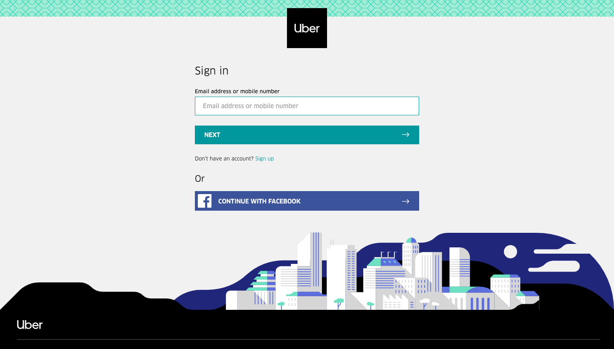

# UberAppProject

## The Task :briefcase:
Uber have released an example application that uses their external API. It is built in Python using flask.
Your job is to create working development, testing and production environments and to build a pipeline to move the code through them using Jenkins.

## Our Progress
- Create Nginx cookbook - :white_check_mark:
- Create Python cookbook - :white_check_mark:
- Create Cookbook tests that pass - :white_check_mark:
- Create app project directory - :white_check_mark:
- Configure the Berks Vendor - :white_check_mark:
- Add the chef content to the app and arrange the file structure - :white_check_mark:
- Add the vagrant file and configure it - :white_check_mark:
- Confirm the environment is fully provisioned for the app to run - :white_check_mark:
- Run the machine and make sure the Uber app is reachable - :white_check_mark:
- Create a link between Github & Jenkins - :white_check_mark:
- Create the first Jenkins job that merges to master - :white_check_mark:
- Create tests for the merging job - :red_circle:
- Create a second Jenkins job that makes a AMI (Amazon Machine Image) - :red_circle:
- Confirm AMI has been made on AWS(Amazon Web Services) - :red_circle:

## How to Install :computer:
- To begin, clone the GitHub repository [HERE](https://github.com/ARLeslie95/UberAppProject)
- Navigate into the UberAppProject file and run `berks vendor cookbooks`
- Now run `vagrant up` to start the application.
- Open your internet browser and type [http://development.local](http://development.local)
- If successful you will see this page.

## Further Development :construction:
If you wish to perform updates on the repository follow the below steps.
- Change to the 'dev' branch using `git checkout dev`
- Make the changes
- Then Push to the 'dev' branch using `git push origin dev`
- From here the process is automatic, see below for more information.

## The Pipeline :twisted_rightwards_arrows:
The UberAppProject has a development pipeline.
This is what happens when you make changes and push to the 'dev' branch.
- Push to development branch.
- Jenkins webhook is activated automatically.
- Jenkins then runs the code against the written tests.
- If the code passes then it is automatically merged to master.
- A second Jenkins job is activated on completion of the last.
- Jenkins then interacts with Amazon Web Services and creates a Amazon Machine Image.
